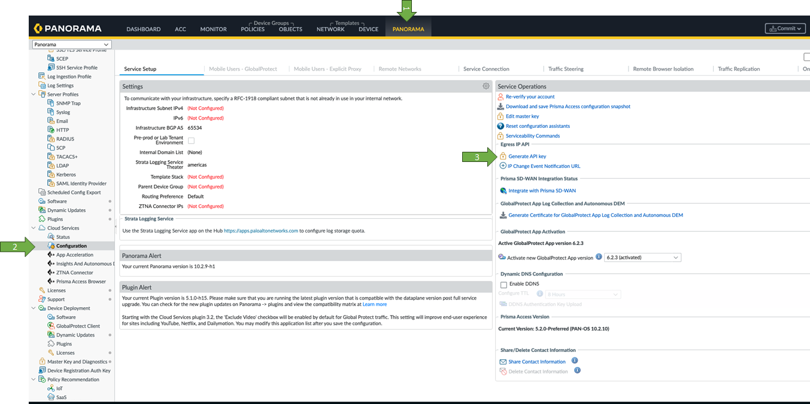
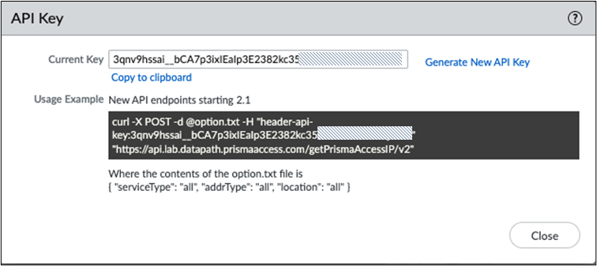
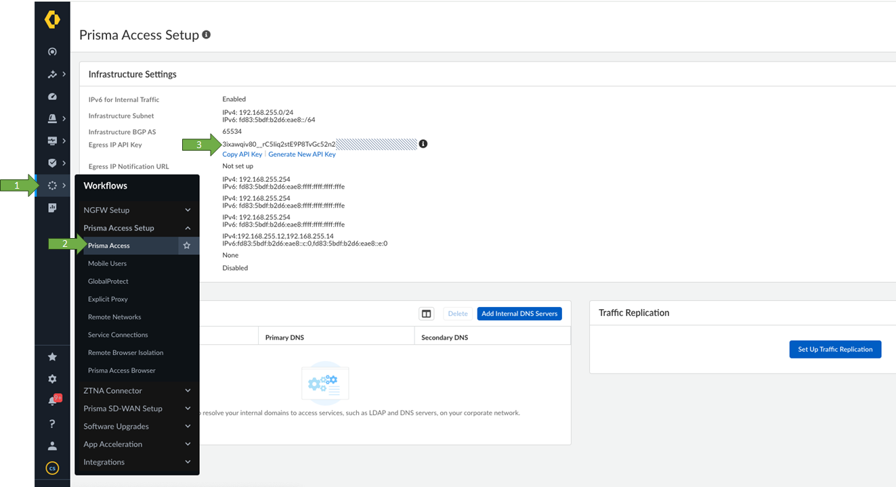

# pa_egress_ip_addresses

## Introduction
This python script allows you extract the public IP addresses assigned to the Palo Alto Prisma Access services, and display those in an more explained and readable format.

## Overview about Prisma Access Egress Public IP Addresses.
If you are manually adding IP addresses of your Prisma Access infrastructure to an allow list in your network or to egress traffic to the internet and SaaS apps, or if you need to enforce IP-based restrictions to 
limit inbound access to enterprise applications, you should understand what these addresses do and why you need to allow them, as well as the tasks you perform to retrieve them.

Prisma Access does not provision these IP addresses until after you complete your Prisma Access configuration and this configuration is commited. After your deployment is complete, can you retrieve these IP addresses using an API. 
The API uses an API key that you obtain from the Prisma Access management UI, either Panorama or Strata Cloud Manager based. 

## How to obtain the API key in a Panaroma based Prisma Access managed tenant.

1. Login Panaroma UI with administrative user. Click in `Panorama`
2. Click in `"Cloud Services" -> "Configuration"`.
3. Click in `"Generate API Key"`




4. On the popup screen, click in `"Copy to clipboard"` to copy the API key. In case this is the first time you are creating the API key, click first in `"Generate New API Key"` and them, click in `"Copy to clipboard"` to copy the API key. 



5. Save the API key for later use.

## How to obtain the API key in a Strata Cloud Manager based Prisma Access managed tenant.

1. Login into Strata Cloud Manager UI with administrative user.
2. Click in `"Workflows" -> "Prisma Access"`.
3. Under the section `Infrastructure Settings`, find the option `Egress IP API Key`
4. Click in `"Copy API Key"` to copy the key. In case this is the first time you are creating the API key, click first in `"Generate New API Key"` and then, click in `"Copy API Key"` to copy the key. 




4. Save the API key for later use.

## How to Use

1. Clone repository with `git clone https://github.com/ibrugnolli/pa_egress_ip_addresses`
2. Change directory to `pa_egress_ip_addresses`
3. Edit `pa_env.py`
* Update the variable `X_PAN_KEY`, in line 2, with your API key.
* Example: `X_PAN_KEY = "_your_api_key__"`
* Save the file
4. Run the script:
```
python3 pa_egress_ip.py
```

Successful Terminal output (sample)
```
root@linux:# python3 pa_egress_ip.py
Testing Enviroment: lab
Enviroment Found - API Key OK

Fetching Mobile Users - GlobalProtect Gateway IP addresses
Egress IP: 165.88.255.7 , Zone: France North , Allocation: deployed
Egress IP: 165.88.255.2 , Zone: France North , Allocation: deployed
Egress IP: 207.127.143.148 , Zone: Belgium , Allocation: deployed
Egress IP: 207.127.142.166 , Zone: Belgium , Allocation: deployed
Egress IP: 128.72.75.97 , Zone: France South , Allocation: reserved
Egress IP: 130.47.123.185 , Zone: France South , Allocation: reserved
Egress IP: 34.106.60.8 , Zone: Netherlands Central , Allocation: reserved
Egress IP: 34.105.61.179 , Zone: Netherlands Central , Allocation: reserved
Egress IP: 34.105.43.221 , Zone: UK , Allocation: reserved
Egress IP: 34.96.175.115 , Zone: UK , Allocation: reserved
Egress IP: 130.43.187.216 , Zone: Netherlands South , Allocation: reserved
Egress IP: 208.123.142.183 , Zone: Netherlands South , Allocation: reserved

Fetching Mobile Users - GlobalProtect Portal IP addresses
Egress IP: 208.124.45.216 , Zone: UK , Allocation: deployed
Egress IP: 208.128.43.49 , Zone: UK , Allocation: deployed
Egress IP: 34.253.183.5 , Zone: Ireland , Allocation: deployed
Egress IP: 34.252.184.65 , Zone: Ireland , Allocation: deployed

Fetching Remote Networks IP addresses
['BRANCH_01', 'BRANCH_02']
Egress IP: 130.43.152.186 , Zone: Germany Central , Allocation: deployed

Fetching  Explicit Proxy location, ACS Services, and the network load balancers IP addresses
Egress IP: 34.124.74.46 , Zone: Belgium , Allocation: deployed
Egress IP: 34.124.74.45 , Zone: Belgium , Allocation: deployed
Egress IP: 165.55.127.133 , Zone: Belgium , Allocation: deployed
Egress IP: 34.130.72.104 , Zone: Global , Allocation: deployed
Egress IP: 34.137.238.171 , Zone: Global , Allocation: deployed
Egress IP: 130.221.39.43 , Zone: Global , Allocation: deployed
Egress IP: 35.195.22.129 , Zone: Global , Allocation: deployed
Egress IP: 34.66.70.57 , Zone: Global , Allocation: deployed
root@linux:#
```

Unsuccessful Terminal output (sample) - invalid API Key
```
root@linux:# python3 pa_egress_ip.py
Testing Enviroment: lab
Incorrect Enviroment
Testing Enviroment: prod
Incorrect Enviroment
Testing Enviroment: prod2
Incorrect Enviroment
Testing Enviroment: prod3
Incorrect Enviroment
Testing Enviroment: prod4
Incorrect Enviroment
Testing Enviroment: prod5
Incorrect Enviroment
Testing Enviroment: prod6
Incorrect Enviroment
Testing Enviroment: prod7
Incorrect Enviroment
no valid API
root@linux:#
```

## References
See also: [Retrieve the IP Addresses for Prisma Access](https://docs.paloaltonetworks.com/prisma/prisma-access/3-1/prisma-access-panorama-admin/prisma-access-overview/retrieve-ip-addresses-for-prisma-access)


